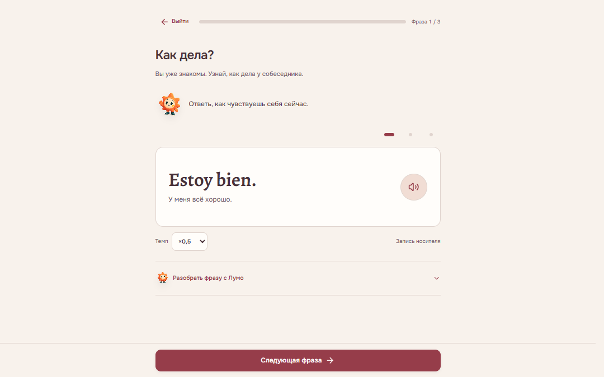
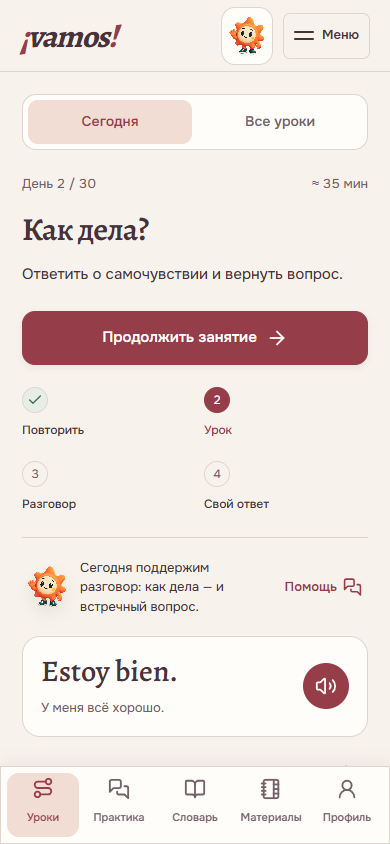
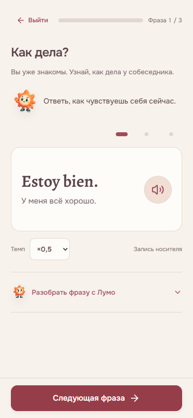

<div align="center">

<a href="https://samandarmansurkhodjaev2713.github.io/vamos-spanish/">
  
</a>

<h1>¡Vamos!</h1>

<p><strong>Испанский, который хочется использовать.</strong><br>
Короткие разговоры. Настоящие голоса. Понятный следующий шаг.</p>

<p>
  
  
  
</p>

<p><a href="https://samandarmansurkhodjaev2713.github.io/vamos-spanish/"><strong>Начать занятие →</strong></a></p>

<p><a href="#как-проходит-занятие">Занятие</a> · <a href="#что-внутри">Возможности</a> · <a href="#запустить-локально">Запуск</a> · <a href="#проверки">Проверки</a> · <a href="#источники-и-права">Источники</a></p>

</div>



**¡Vamos! — самостоятельный курс разговорного испанского для русскоязычного новичка.** Занятие разделено на последовательные экраны: услышать, понять, собрать фразу, вспомнить её и применить в разговоре. Лумо помогает разобрать текущую реплику; перевод и подробности раскрываются тогда, когда нужны.

Тёплая винно-персиковая палитра, Onest и Alegreya, спокойные переходы и нижняя навигация объединяют урок, словарь и практику в один продукт. Все изображения ниже — снимки работающего приложения.

## Как проходит занятие

На экране **«Сегодня»** — текущий день, цель и одна кнопка продолжения. Незавершённое занятие сохраняется: можно вернуться к своей фразе, заданию или разговору.

| Часть | Что делать | Зачем |
| :--- | :--- | :--- |
| **Повторение** | Вспомнить знакомые карточки; после суток вернуться к разговору | Проверить, что осталось в памяти |
| **Урок** | Прослушать три фразы, затем пройти задания по одному | Подготовить реплики к сегодняшней ситуации |
| **Разговор** | Ответить собеседнику в короткой сцене | Связать отдельные фразы в обмен репликами |
| **Свой ответ** | Изменить условие, сказать о себе и оценить попытку | Использовать материал без готового ответа |

Ориентир — **30–40 минут в день**. Если повторять пока нечего, путь начинается с урока. Просмотр экрана и истечение времени сами по себе не завершают занятие.

<table>
  <tr>
    <td align="center" width="50%"><strong>Сегодня: ясно, с чего начать</strong></td>
    <td align="center" width="50%"><strong>В уроке: одна фраза за раз</strong></td>
  </tr>
  <tr>
    <td align="center"></td>
    <td align="center"></td>
  </tr>
</table>

## Что внутри

| Раздел | Возможности |
| :--- | :--- |
| **Учиться** | 30 основных дней, выбор дня, сохранение шага, цель и проверяемые действия каждого занятия |
| **Практика** | Слух, смысл, сборка предложений, воспроизведение по памяти, разговорные сцены и ответ в изменённой ситуации |
| **Словарь** | Слова, фразы, предложения и мини-тексты по темам; поиск, избранное, заметки, трудные единицы и тренировка выбранного набора |
| **Чтение и материалы** | Короткие истории, вопросы по смыслу, мастерские предложений и дополнительные видеоссылки, включая русскоязычные |
| **Голос** | 72 оригинальные записи носителей, темп **0,5×–1,25×**, запись своего ответа, локальный архив и сравнение попыток |
| **Профиль** | Прогресс, история занятий, достижения, настройки и экспорт/объединение данных |

Ошибки и помощь влияют на последующую практику. Система хранит первую проверенную попытку отдельно от исправлений; сложные фразы возвращаются в повторение. Подбор работает локально и отключается в настройках.

**В словаре звучит именно подписанный пример.** Если слово записано внутри предложения, полное озвучиваемое предложение показано отдельно. Новые авторские тексты и переменные ответы имеют запись носителя только там, где есть соответствующий оригинал.

<details>
<summary><strong>Произношение, прогресс и честные границы проверки</strong></summary>

- Запись позволяет сравнить свой голос с носителем. Необязательное распознавание проверяет распознанные слова; акцент, отдельные звуки и CEFR оно не оценивает.
- Подготовленные задания проверяются по конечному набору ответов. Свободная реплика получает самооценку, а не автоматическую оценку всей грамматики.
- Проверка после паузы относится к выбранным фразам. Она не подтверждает владение всем языком.
- Продолжение **31–90** укрепляет базу и вводит отдельные конструкции A2/B1. Это не полный курс до C1.
- В выпуске **6.13** переработаны вводные сцены первых двух дней и общий последовательный путь 30 основных уроков. Это не заявление о полной редакционной переработке каждого материала.
- Курс не обещает свободную речь, отсутствие акцента или гарантированный уровень за 30 дней.

</details>

## На телефоне и без сети

При поддержке браузера курс устанавливается на главный экран, сохраняет аудио офлайн и предлагает быстрые действия. Темп, оформление, крупный текст, звуки и движение настраиваются в профиле; предпочтение уменьшенного движения учитывается.

Для аудио без сети: **настройки → «Курс под рукой» → «Сохранить аудио офлайн»**. Дождись проверки **72/72**. Первое открытие требует сети; браузер может очистить кэш при нехватке места.

<details>
<summary><strong>Данные и возможности браузера</strong></summary>

Прогресс хранится в `localStorage` этого браузера, сохранённые записи голоса — отдельно в `IndexedDB`. Учётных записей и облачной синхронизации нет. JSON-экспорт переносит прогресс; голосовые записи скачиваются отдельно.

Микрофон включается по явному действию. Необязательное распознавание может передавать звук провайдеру браузера; режим на устройстве зависит от поддержки испанского языкового пакета. Приложение не отправляет запись на собственный сервер.

Установка, полноэкранный режим, удержание экрана, счётчик и смена значка зависят от платформы. Варианты значка доступны в приложении; обновление уже установленной системной иконки не гарантируется. Системные виджеты и доставка напоминаний при закрытом приложении не реализованы. Видеоссылки требуют сети.

</details>

## Запустить локально

Нужен **Python 3**. Для проверок логики — также **Node.js**. Установка npm-зависимостей для работы приложения не требуется.

```sh
git clone https://github.com/SamandarMansurkhodjaev2713/vamos-spanish.git
cd vamos-spanish
python -m http.server 8768 --bind 127.0.0.1 --directory web
```

Открой [localhost:8768](http://127.0.0.1:8768/). Backend и API-ключи не нужны.

После изменения данных или кода:

```sh
python build-course-v2.py
python build-deploy.py
```

Первый сборщик обновляет данные курса, HTML и версии ресурсов. Второй собирает публикацию в `docs/`, сверяя оригинальные аудиофайлы по SHA-256. GitHub Pages публикует **`main` → `/docs`**.

## Проверки

Текущие проверки конечных ответов, состояния занятия и файлов публикации:

```sh
node check-exercises-v26.cjs
node check-studio-v26.cjs
python check-release-v26.py
```

- **Задания:** независимые ожидаемые ответы, 30 тем, 60 квизов, слух и смысл, сборка, пропуски, воспоминание, первые попытки и 72 пары аудио/метаданных.
- **Путь занятия:** отложенный разговор → карточки → новый урок; продолжение, выход, старые сохранения и соответствие контрольных дней.
- **Публикация:** согласованность `web/` и `docs/`, версии ресурсов и неизменность оригинальных аудио.

Проверки подтверждают эти сценарии и конечную базу. Они не заменяют испытания на каждом физическом устройстве или исследование результатов обучения. Старые `check-*-v*.cjs` сохраняют историю предыдущих выпусков; часть использует прежние селекторы интерфейса.

<details>
<summary><strong>Как устроен репозиторий</strong></summary>

```text
web/                    исходный статический runtime
docs/                   проверенная публикация GitHub Pages
course-*.json           программа, упражнения, словарь и тексты
mission-data.json       подготовленные разговорные сцены
pathway-data.json       продолжение 31–90
video-guide-v13.json    дополнительные видеоматериалы
build-course-v2.py      сборка данных и версий ресурсов
build-deploy.py         сборка публикации и проверка аудио
check-*.cjs / *.py      проверки сценариев и содержимого
.github/                снимки приложения и шаблоны обратной связи
```

HTML, CSS и JavaScript без фреймворка. Модули разделяют урок, разговоры, повторение, словарь, записи, профиль и возможности браузера. Service Worker обслуживает офлайн-оболочку; аудио сохраняется отдельно по запросу.

</details>

## Обратная связь

Нашёл неверный ответ, несовпадение записи или неудобный экран? [Сообщи об ошибке](https://github.com/SamandarMansurkhodjaev2713/vamos-spanish/issues/new/choose): укажи день, условие, свой ответ и ожидаемое поведение. Для проблем интерфейса полезны шаги воспроизведения и браузер.

Изменение учебного материала должно согласовывать вопрос, допустимые ответы, перевод, объяснение и запись. Новое аудио добавляется только с подтверждённым источником, правами и атрибуцией.

## Источники и права

**Аудио носителей — [Tatoeba](https://tatoeba.org/).** 72 оригинальных MP3 поставляются без изменения байтов. Основной голос — [arh, Кастилия, Испания](https://tatoeba.org/en/user/profile/arh); автор каждой записи указан отдельно. Лицензия **CC BY-NC-ND 3.0** и условия конкретного файла сохраняются: аудио предназначено для некоммерческого использования. Авторы записей не заявляются партнёрами курса.

[Полная атрибуция и SHA-256](docs/assets/audio/ATTRIBUTION.json) · [Пояснение к аудио](docs/assets/audio/README.txt) · [Лицензия CC BY-NC-ND 3.0](https://creativecommons.org/licenses/by-nc-nd/3.0/)

Испанские тексты Tatoeba распространяются под **CC BY 2.0 FR**; русские переводы, пояснения и авторские материалы подготовлены для курса. Новые ответы не озвучиваются синтезом. Диалоги используют последовательность отдельных оригинальных записей, а не цельную студийную фонограмму.

Шрифты [Onest](docs/assets/Onest-OFL.txt) и [Alegreya](docs/assets/Alegreya-OFL.txt) — SIL Open Font License; [Lucide](docs/assets/lucide-LICENSE.txt) — ISC. Лумо — оригинальный персонаж курса.

Для всего репозитория единая лицензия не заявлена. Права на сторонние материалы определяются их собственными условиями.

---

<div align="center">
<p><strong>Твоя следующая фраза — по-испански.</strong></p>
<a href="https://samandarmansurkhodjaev2713.github.io/vamos-spanish/">Открыть ¡Vamos! →</a>
</div>
