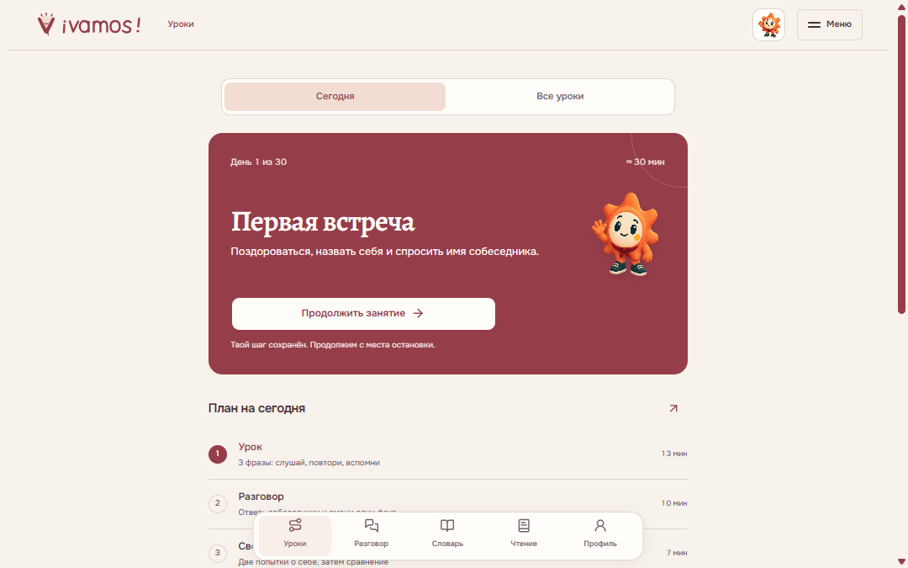
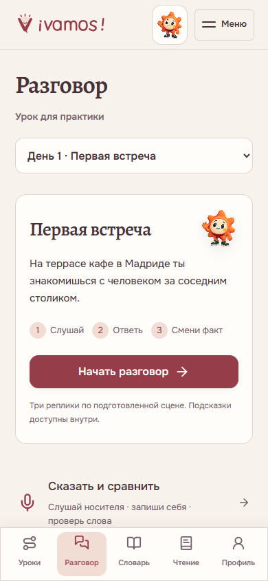
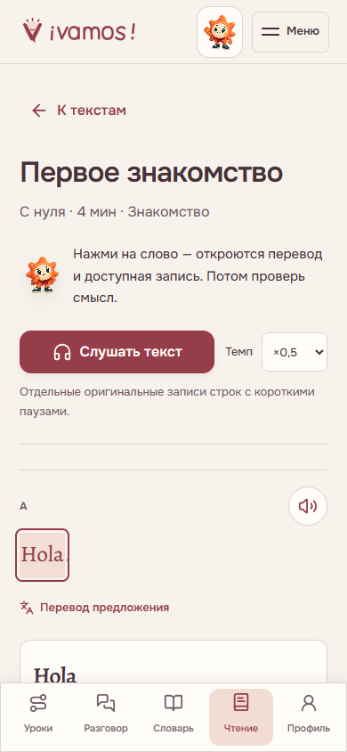
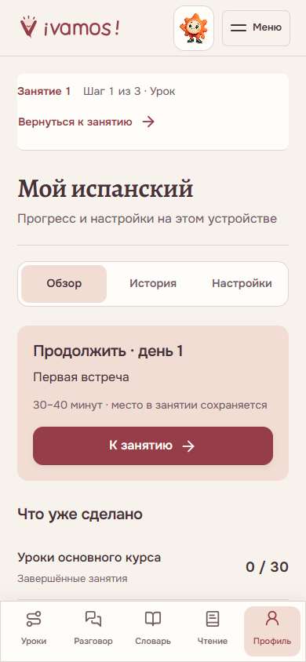

<div align="center">

<a href="https://samandarmansurkhodjaev2713.github.io/vamos-spanish/">
  
</a>

<h1>¡Vamos!</h1>

<p><strong>Испанский, который хочется использовать.</strong><br>
Короткие разговоры. Настоящие голоса. Понятный следующий шаг.</p>

<p>
  
  
  
</p>

<p><a href="https://samandarmansurkhodjaev2713.github.io/vamos-spanish/"><strong>Начать занятие →</strong></a></p>

<p><a href="#как-проходит-занятие">Занятие</a> · <a href="#что-внутри">Возможности</a> · <a href="#запустить-локально">Запуск</a> · <a href="#проверки">Проверки</a> · <a href="#источники-и-права">Источники</a></p>

</div>



**¡Vamos! — самостоятельный курс разговорного испанского для русскоязычного новичка.** Занятие разделено на последовательные экраны: услышать, понять, собрать фразу, вспомнить её и применить в разговоре. Лумо помогает разобрать текущую реплику; перевод и подробности раскрываются тогда, когда нужны.

Тёплая винно-персиковая палитра, Onest и Alegreya и нижняя навигация объединяют урок, словарь и практику в один продукт. Короткие переходы отмечают смену экрана, а Лумо реагирует на результат задания; выбор ответа, печать и раскрытие перевода не запускают переход заново. Движение отключается отдельно от звуков. Все изображения ниже — снимки работающего приложения.

## Как проходит занятие

На экране **«Сегодня»** — текущий день, цель и одна кнопка продолжения. Незавершённое занятие сохраняется: можно вернуться к своей фразе, заданию или разговору.

| Часть | Что делать | Зачем |
| :--- | :--- | :--- |
| **Повторение · 5 мин** | Вспомнить знакомые карточки; после суток вернуться к разговору | Проверить, что осталось в памяти |
| **Урок · 13 мин** | Для каждой из трёх фраз: услышать смысл → повторить дважды → вспомнить без образца; затем задания по одному | Подготовить реплики к сегодняшней ситуации |
| **Разговор · 10 мин** | Ответить собеседнику в короткой сцене, затем изменить один факт | Связать отдельные фразы в обмен репликами |
| **Свой ответ · 7 мин** | Сказать свою версию, повторить трудный обмен и оценить попытку | Использовать материал без готового ответа |

Ориентир — **30–40 минут в день**. Если повторять пока нечего, путь начинается с урока. Просмотр экрана и истечение времени сами по себе не завершают занятие. У каждого из 30 дней есть своя цель, точные модели, изменённая ситуация, критерии самопроверки и попытка на следующий день.

Программа использует вспоминание до показа ответа и возвращение после паузы, опираясь на [обзор практики обучения Dunlosky и соавторов](https://pubmed.ncbi.nlm.nih.gov/26173288/). Слушание, понятный текст, собственный ответ и повторная речь распределены по подходу [Four Strands Пола Нейшена](https://www.wgtn.ac.nz/lals/resources/paul-nations-resources/paul-nations-publications/publications/documents/2007-Four-strands.pdf). Это адаптация методов к курсу; эффективность именно ¡Vamos! пока не исследована.

<table>
  <tr>
    <td align="center" width="50%"><strong>Сегодня: ясно, с чего начать</strong></td>
    <td align="center" width="50%"><strong>В уроке: одна фраза за раз</strong></td>
  </tr>
  <tr>
    <td align="center"></td>
    <td align="center"></td>
  </tr>
</table>

## Что внутри

| Раздел | Возможности |
| :--- | :--- |
| **Уроки** | 30 основных дней; последовательные экраны, подсказки по текущей задаче и сохранение шага. Новые вопросы дней 9/10 разбираются перед собственным ответом |
| **Разговор** | Слушание → свой ответ → новая деталь. День 13 тренирует частоту и встречный вопрос, день 16 — реакцию на хорошую новость и невозможность прийти; отдельный тренажёр «Образец → Мой голос → Проверка слов» |
| **Словарь** | **480 материалов в 16 темах:** 221 слово, 103 фразы, 144 предложения, 12 текстов. Прослушивание прямо в списке, точные результаты поиска первыми, избранное и практика выбранного материала |
| **Чтение** | **60 материалов:** 30 сцен по дням, 12 чтений с оригинальными записями строк, 10 текстов по уровням, две истории по три главы и две новые статьи. Уровень, формат, тема и фильтр полной озвучки; перевод слова вместе с предложением, выбор озвученного отрывка, вопросы и пересказ |
| **Голос** | **72 записи фраз + 51 отдельная запись слов**, темп **0,5×–1,25×**, запись своего ответа и локальный архив. У новых попыток с сохранённым источником точный образец носителя доступен рядом со своей записью; можно сравнить две попытки и вернуться к списку |
| **Профиль** | Три экрана — **Обзор / История / Настройки**. Завершённые уроки, первые самостоятельные ответы, устная самооценка и чтение считаются отдельно; экспорт и объединение данных |

Ошибки и помощь влияют на последующую практику. Система хранит первую проверенную попытку отдельно от исправлений; сложные фразы возвращаются в повторение. В день 29 предлагаются до двух уже знакомых фраз с причиной выбора: ошибка, помощь или подошедший срок повторения. Если подходящих наблюдений нет, показана обычная практика без выдуманной оценки слабых мест. Адаптивный подбор работает локально и отключается в настройках.

**У записи всегда есть точная подпись.** Отдельная кнопка слова воспроизводит слово; кнопка всей фразы — показанную фразу. В чтении доступная запись выбранного слова запускается по нажатию. Частично озвученные сцены показывают число записанных реплик; авторским текстам синтетический голос не подставляется.

<table><tr><td width="50%" align="center"><strong>Разговор: одна ясная точка входа</strong><br></td><td width="50%" align="center"><strong>Чтение: текст и озвучка рядом</strong><br></td></tr></table>

<details>
<summary><strong>Произношение, прогресс и честные границы проверки</strong></summary>

- Запись позволяет сравнить свой голос с носителем. Необязательное распознавание проверяет распознанные слова; акцент, отдельные звуки и CEFR оно не оценивает.
- Подготовленные задания проверяются по конечному набору ответов. Свободная реплика получает самооценку, а не автоматическую оценку всей грамматики.
- Проверка после паузы относится к выбранным фразам. Она не подтверждает владение всем языком.
- Продолжение **31–90** укрепляет базу и вводит отдельные конструкции A2/B1. Это не полный курс до C1.
- В **6.15** уточнены ежедневные задания и подготовка новых реплик, разговорные цели дней 13/16 и повторение дня 29. Добавлены защита записи при переходах и восстановительные копии при конфликте вкладок. Сохранены 480 идентификаторов материалов и байты 123 оригинальных аудиофайлов. Точечно исправлены различие «утром / завтра» для `mañana` и вопросительный контекст `cómo`.
- Курс не обещает свободную речь, отсутствие акцента или гарантированный уровень за 30 дней.

</details>

<table><tr><td width="50%" align="center"><strong>Урок: слушай → повтори → вспомни</strong><br></td><td width="50%" align="center"><strong>Профиль: всё на своём месте</strong><br></td></tr></table>

## На телефоне и без сети

При поддержке браузера курс устанавливается на главный экран, сохраняет аудио офлайн и предлагает быстрые действия. Темп, оформление, крупный текст, звуки и движение настраиваются в профиле; предпочтение уменьшенного движения учитывается.

Для аудио без сети: **профиль → настройки → «Курс под рукой» → «Записи без интернета» → «Сохранить аудио офлайн»**. Дождись проверки **123 из 123**. Первое открытие требует сети; браузер может очистить кэш при нехватке места.

На странице «Сегодня» есть минутное повторение слов. В настройках Лумо можно скачать ежедневное событие **.ics** для календаря устройства: напоминание работает после ручного импорта. Доступны четыре ярлыка установленного приложения — «Сегодня», «Разговор», «Словарь», «Чтение», если их поддерживает система.

<details>
<summary><strong>Данные и возможности браузера</strong></summary>

Прогресс хранится в `localStorage` этого браузера, сохранённые записи голоса — отдельно в `IndexedDB`. Учётных записей и облачной синхронизации нет. JSON-экспорт переносит прогресс; голосовые записи скачиваются отдельно.

**Перед добавлением на главный экран iPhone/iPad сохрани JSON прогресса**, затем импортируй его в открытом с иконки приложении. WebKit указывает, что при создании такого приложения локальное хранилище не копируется: [описание поведения Safari 17.2](https://webkit.org/blog/14787/webkit-features-in-safari-17-2/). Голосовые записи скачай отдельно: JSON не переносит архив.

При обычном переходе между разделами микрофон останавливается, а готовая попытка остаётся доступной. День, фраза и контекст записи фиксируются при начале захвата. **До перезагрузки или закрытия страницы сохрани попытку в архив либо скачай её**: текущая несохранённая запись временная. Распознавание слов запускает новую попытку через микрофон; готовый аудиофайл ему не передаётся.

Если прогресс изменился в другой вкладке, экран задания и введённый ответ не подменяются автоматически. Совместимые изменения объединяются при сохранении; для конфликтующих ответов и заметок сохраняются скачиваемые копии обеих версий. После задания можно обновить экран, а нужную копию — импортировать через профиль. Одновременные записи в `localStorage` не имеют гарантии атомарной синхронизации.

Микрофон включается по явному действию. Необязательное распознавание может передавать звук провайдеру браузера; режим на устройстве зависит от поддержки испанского языкового пакета. Приложение не отправляет запись на собственный сервер.

Установка, полноэкранный режим, удержание экрана, счётчик и смена значка зависят от платформы. Варианты значка доступны в приложении; обновление уже установленной системной иконки не гарантируется. Системные виджеты и доставка напоминаний при закрытом приложении не реализованы. Видеоссылки требуют сети.

</details>

## Запустить локально

Нужен **Python 3**. Для проверок логики — также **Node.js**. Установка npm-зависимостей для работы приложения не требуется.

```sh
git clone https://github.com/SamandarMansurkhodjaev2713/vamos-spanish.git
cd vamos-spanish
python -m http.server 8768 --bind 127.0.0.1 --directory web
```

Открой [localhost:8768](http://127.0.0.1:8768/). Backend и API-ключи не нужны.

После изменения данных или кода:

```sh
python build-course-v2.py
python build-deploy.py
```

Первый сборщик обновляет данные курса, HTML и версии ресурсов. Второй собирает публикацию в `docs/`, сверяя оригинальные аудиофайлы по SHA-256. GitHub Pages публикует **`main` → `/docs`**.

## Проверки

Основной набор проверок учебных заданий и реальных переходов состояния:

```sh
node check-exercises-v28.cjs
node check-studio-v28.cjs
node check-preparation-v29.cjs
node check-daily-plan-v28.cjs
node check-mission-path-v30.cjs
node check-library-practice-v30.cjs
node check-reader-v28.cjs
node check-reader-context-v30.cjs
node check-reader-search-v30.cjs
node check-speech-v30.cjs
node check-recording-v30.cjs
node check-recordings-model-v30.cjs
```

- **Учебные ответы:** 30 тем, квизы, слух и смысл, порядок слов, пропуски и вспоминание; первая попытка сохраняется отдельно от исправления с помощью.
- **Занятие:** отложенный разговор → карточки → новый урок; возвращение, подготовка новых моделей, скрытие образца и сохранение конкретной темы при восстановлении.
- **Разговорные цели:** частота и неизвестный интерес в день 13; уместная положительная/отрицательная реакция и вопрос о причине в день 16. Проверяются допустимые и неподходящие ответы, старые сцены и их первые попытки.
- **Чтение и словарь:** конечные ключи вопросов, перевод в контексте, точная подпись аудио, возврат к материалу, сохранение ответов и повторение выбранных карточек.
- **Голос:** переходы между образцом, своей записью и проверкой слов; отсутствие распознавания, согласие перед запуском, устаревшие callbacks, поздний ответ микрофона и сохранение исходной подписи записи.

<details>
<summary><strong>Расширенные проверки: данные, восстановление и публикация</strong></summary>

```sh
node check-lesson-support-v28.cjs
node check-library-v29.cjs
node check-library-search-v30.cjs
node check-library-session-v30.cjs
node check-missions-v29.cjs
node check-weak-focus-v30.cjs
node check-profile-v28.cjs
node check-backup-v29.cjs
node check-progress-focus-v30.cjs
node check-cross-tab-v29.cjs
node check-reload-v30.cjs
node check-motion-v30.cjs
node check-audio-focus-v30.cjs
node check-curriculum-v30.cjs
node check-native-v29.cjs
python check-guidance-v29.py
python check-style-versions-v30.py
python check-release-v28.py
```

`check-curriculum-v30.cjs` ограничивает изменения подготовки и личных задач относительно закреплённого baseline `f18373b`; отдельные негативные сценарии отклоняют изменения чужих полей. `check-mission-path-v30.cjs` проверяет смысловые границы новых сцен и сохранность архивных версий.

Проверки вкладок и импорта охватывают первые ответы, совместимые изменения, конфликтующие копии и повреждённое хранилище. Проверки офлайна сверяют хэши всех 123 оригиналов, восстановление кэша и календарный файл. Публикацию проверяют отдельно после сборки и выкладки: согласованность `web/` и `docs/`, версии ресурсов и фактические ответы сайта.

</details>

Это проверки конечной базы и указанных сценариев. Они не заменяют испытания на каждом физическом устройстве или исследование результатов обучения. Проверки микрофона используют управляемые модели браузерных API; качество реального звучания оценивается отдельно. Старые `check-*-v*.cjs` сохраняют историю выпусков; часть использует прежние селекторы интерфейса.

<details>
<summary><strong>Как устроен репозиторий</strong></summary>

```text
web/                    исходный статический runtime
docs/                   проверенная публикация GitHub Pages
course-*.json           программа, упражнения, словарь и тексты
mission-data.json       подготовленные разговорные сцены
pathway-data.json       продолжение 31–90
video-guide-v13.json    дополнительные видеоматериалы
build-course-v2.py      сборка данных и версий ресурсов
build-deploy.py         сборка публикации и проверка аудио
check-*.cjs / *.py      проверки сценариев и содержимого
.github/                снимки приложения и шаблоны обратной связи
```

HTML, CSS и JavaScript без фреймворка. Модули разделяют урок, разговоры, повторение, словарь, записи, профиль и возможности браузера. Service Worker обслуживает офлайн-оболочку; аудио сохраняется отдельно по запросу.

</details>

## Обратная связь

Нашёл неверный ответ, несовпадение записи или неудобный экран? [Сообщи об ошибке](https://github.com/SamandarMansurkhodjaev2713/vamos-spanish/issues/new/choose): укажи день, условие, свой ответ и ожидаемое поведение. Для проблем интерфейса полезны шаги воспроизведения и браузер.

Изменение учебного материала должно согласовывать вопрос, допустимые ответы, перевод, объяснение и запись. Новое аудио добавляется только с подтверждённым источником, правами и атрибуцией.

## Источники и права

**Аудио носителей — [Tatoeba](https://tatoeba.org/).** 72 оригинальных MP3 поставляются без изменения байтов. Основной голос — [arh, Кастилия, Испания](https://tatoeba.org/en/user/profile/arh); автор каждой записи указан отдельно. Лицензия **CC BY-NC-ND 3.0** и условия конкретного файла сохраняются: аудио предназначено для некоммерческого использования. Авторы записей не заявляются партнёрами курса.

[Полная атрибуция и SHA-256](docs/assets/audio/ATTRIBUTION.json) · [Пояснение к аудио](docs/assets/audio/README.txt) · [Лицензия CC BY-NC-ND 3.0](https://creativecommons.org/licenses/by-nc-nd/3.0/)

**Отдельные слова — [Rodelar / Lingua Libre](https://commons.wikimedia.org/wiki/Category:Lingua_Libre_pronunciation_by_Rodelar).** 51 оригинальный испанский WAV с Wikimedia Commons поставляется без изменения байтов под **CC BY-SA 4.0**. У каждого файла сохранены автор, исходная страница, лицензия, SHA-1 и SHA-256. [Атрибуция отдельных слов](docs/assets/word-audio/ATTRIBUTION.json) · [Лицензия CC BY-SA 4.0](https://creativecommons.org/licenses/by-sa/4.0/).

Испанские тексты Tatoeba распространяются под **CC BY 2.0 FR**; русские переводы, пояснения и авторские материалы подготовлены для курса. Новые ответы не озвучиваются синтезом. Диалоги используют последовательность отдельных оригинальных записей, а не цельную студийную фонограмму.

Шрифты [Onest](docs/assets/Onest-OFL.txt) и [Alegreya](docs/assets/Alegreya-OFL.txt) — SIL Open Font License; [Lucide](docs/assets/lucide-LICENSE.txt) — ISC. Лумо — оригинальный персонаж курса.

Для всего репозитория единая лицензия не заявлена. Права на сторонние материалы определяются их собственными условиями.

---

<div align="center">
<p><strong>Твоя следующая фраза — по-испански.</strong></p>
<a href="https://samandarmansurkhodjaev2713.github.io/vamos-spanish/">Открыть ¡Vamos! →</a>
</div>
